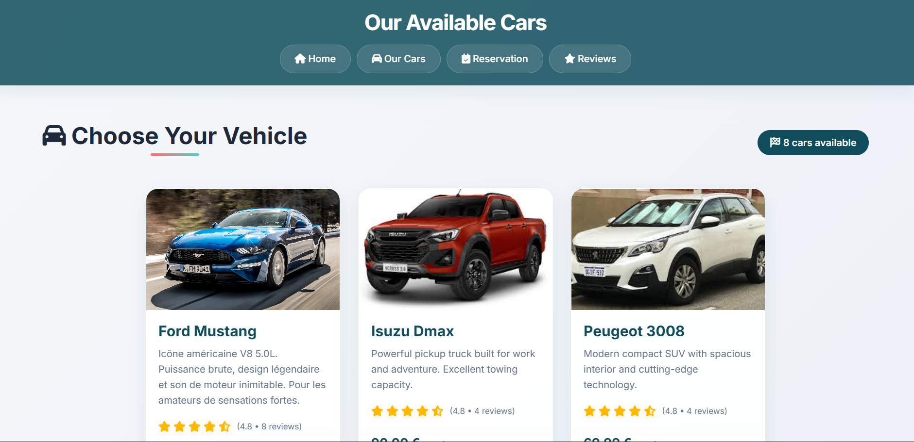
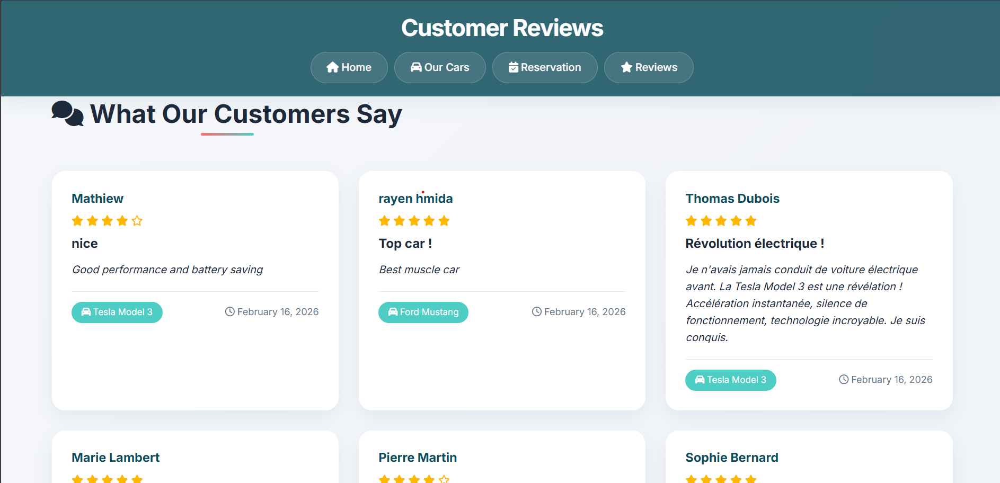
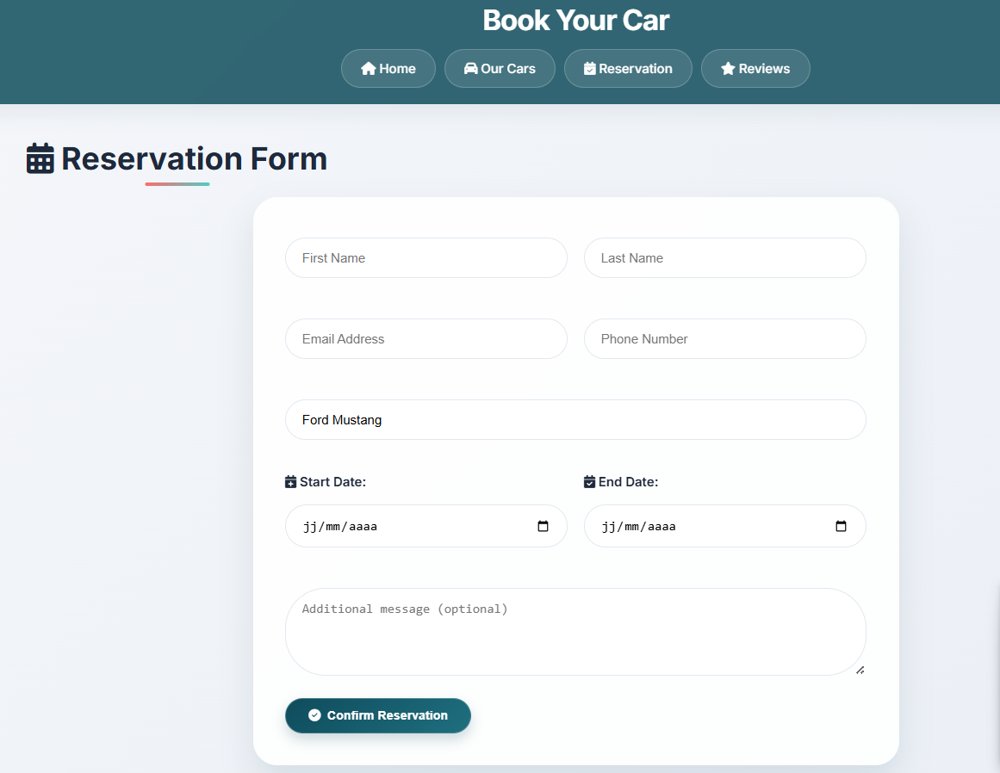

# Car Rental Agency


A simple but complete car rental website. PHP, MySQL, star ratings, customer reviews, and online booking.


!\[Banner](images/banner.jpg)


---


\##  QUICK PREVIEW


##  Home |  |
## Cars |  |
## Ratings |  |
## Reviews |  |
## Booking |  |


---


##  FEATURES


\- ✅ Car catalog with photos

\- ✅ Star rating system (⭐) and customer reviews

\- ✅ Booking form with automatic price calculation

\- ✅ Pagination (6 cars per page)

\- ✅ Responsive design (mobile/tablet/desktop)

\- ✅ Clean and modern interface


---


\## 🛠️ TECH STACK


\- PHP 7.4

\- MySQL

\- HTML/CSS (Flexbox/Grid)

\- JavaScript (vanilla)

\- Font Awesome (icons)


---


\## 📦 INSTALLATION (5 MIN)


\### 1. Download the project

```

git clone https://github.com/RayenHmida647/car-rental.git

```


\### 2. Move to `htdocs`

```

C:\\xampp\\htdocs\\car-rental\\

```
\### 3. Start XAMPP


\### 4. Create database

\- Open phpMyAdmin

\-Run the car_rental.sql file


\### 6. Open Website


\- Open: `http://localhost/car-rental`


---


\## 📁 PROJECT STRUCTURE


```

car-rental/

├── images/           # Car photos + banner

├── screenshots/      # README screenshots

├── index.php         # Home page

├── car.php           # Cars gallery

├── contact.php       # Booking form

├── review\_form.php   # Write a review

├── reviews.php       # Customer reviews

├── footer.php        # Footer

├── db.php            # Database connection

├── style.css         # All styles

├──script.js         # JavaScript

└── car_rental.sql


```


---

\## 👨‍💻 AUTHOR


\*\*Rayen Hmida\*\*  

\- GitHub: \[@RayenHmida647](https://github.com/RayenHmida647)

\- Email: rayen.hmida.pro@gmail.com


---


\## 📄 LICENSE


MIT - Free to use and modify.


---


\## ⭐ LIKE IT?


Give it a star on GitHub! ⭐


---


